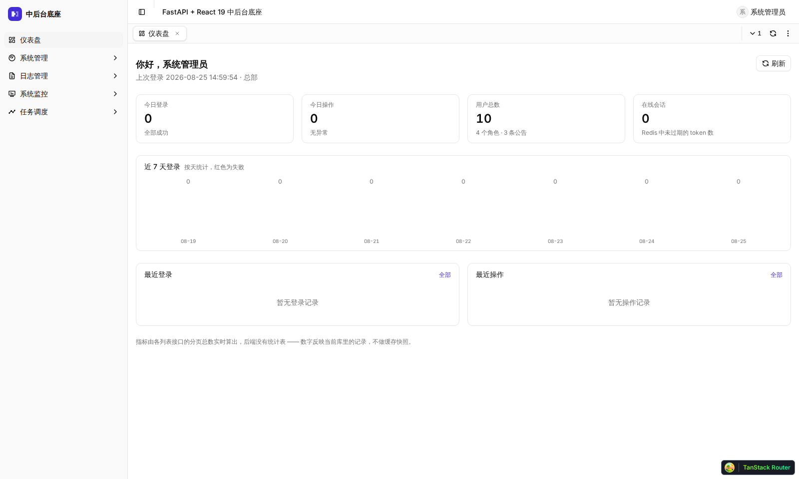
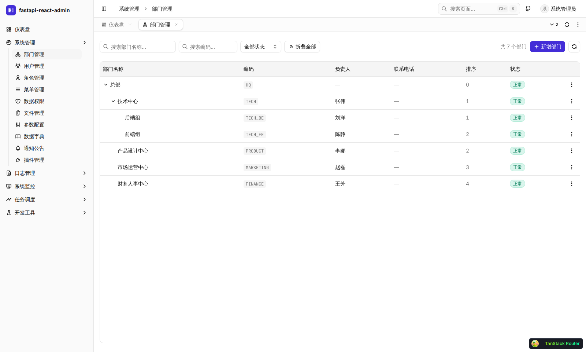
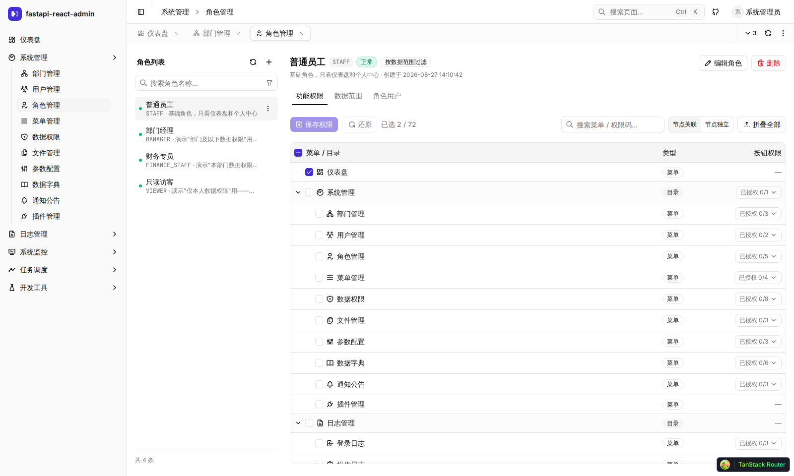
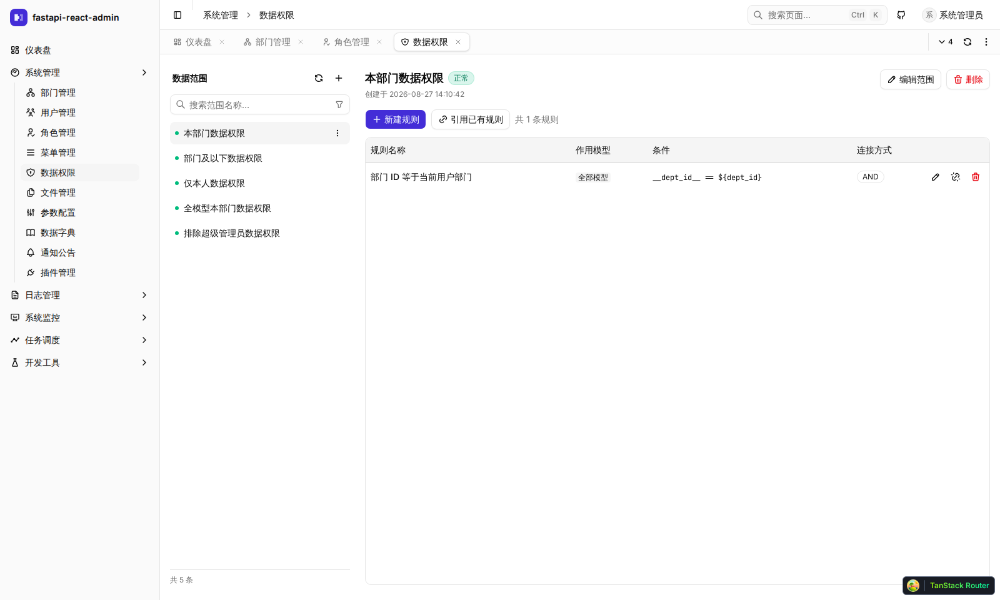

# fastapi-react-admin

**FastAPI + React 19 + shadcn/ui 中后台底座** —— 权限细到按钮和数据行，
多页签切走真的保状态，原生跑 SQL Server。**295 条自动化测试全打真实依赖，不 mock。**

> 🚀 **在线演示 / Live demo：** https://fra.wubunan.com/sign-in
> 账号 `admin` / 密码 `123456` —— 公开演示实例，任何人都能登录，数据会被访客改动/清空，
> 请勿存放真实信息。/ Public demo instance, anyone can log in; data may be altered or wiped
> by other visitors — do not store real information here.

<table>
<tr>
<td width="50%"></td>
<td width="50%"></td>
</tr>
<tr>
<td width="50%"></td>
<td width="50%"></td>
</tr>
</table>

<!-- 前端 -->
[](https://react.dev)
[](https://www.typescriptlang.org)
[](https://vite.dev)
[](https://tailwindcss.com)
[](https://ui.shadcn.com)
[](https://tanstack.com)

<!-- 后端与数据 -->
[](https://fastapi.tiangolo.com)
[](https://www.sqlalchemy.org)
[](https://learn.microsoft.com/sql)
[](https://redis.io)
[](https://docs.celeryq.dev)
[](https://www.electronjs.org)

<!-- 状态与出处 -->
[](./LICENSE)
[](https://github.com/yilecoding/fastapi-react-admin/actions/workflows/ci.yml)
[](https://yilecoding.github.io/fastapi-react-admin/)
[](https://github.com/fastapi-practices/fastapi_best_architecture)

> **后端出自 [fastapi-best-architecture](https://github.com/fastapi-practices/fastapi_best_architecture)（FBA）。**
> 这套的三层结构（`api/v1` → `service` → `crud`）、插件机制、RBAC 与数据权限模型都是它的设计，
> 本仓库是它的 **SQL Server 分叉** —— 上游明确拒绝合并这部分支持，所以是永久分叉，只 cherry-pick 安全补丁。
> 上游同为 MIT，原始版权声明保留在 [`apps/api/LICENSE`](./apps/api/LICENSE)，分叉基线记在 `apps/api/.upstream-baseline`。
> 后端架构文档看上游那份最全：[docs.fba.wu-clan.cc](https://docs.fba.wu-clan.cc/fastapi_best_architecture_docs/)。

[中文](#为什么不是又一个模板) · **[English](#english)**

---

<a id="english"></a>

## English

An admin foundation on **FastAPI + React 19 + shadcn/ui** — permissions down to buttons
*and data rows*, multi-tab navigation that actually keeps state, first-class **SQL Server**,
and **295 automated tests that run against real dependencies, with no mocks**.
Optional **Electron** desktop shell and a native **Expo / React Native** mobile app share
the backend contract and the request client, not the rendering.

Backend derived from **[fastapi-best-architecture](https://github.com/fastapi-practices/fastapi_best_architecture)**
(FBA): its three-layer structure, plugin system, and RBAC / data-scope model. This repo is
FBA's **SQL Server fork** — upstream declined to merge that support, so the fork is permanent
and tracks only security patches. Upstream docs (still the fullest reference for the backend
architecture): [docs.fba.wu-clan.cc](https://docs.fba.wu-clan.cc/fastapi_best_architecture_docs/).

Not a scaffold you fork and ship. It is a *foundation*: the three things below, plus the
hard-won rules in [CLAUDE.md](./CLAUDE.md), are the parts already solved for you. Business
code goes next to `packages/platform/src/pages/user/` and follows the same shape.

|                       | Common approach                                                            | Here                                                                                            |
| --------------------- | -------------------------------------------------------------------------- | ----------------------------------------------------------------------------------------------- |
| **Permission grain**  | menus + buttons                                                            | menus + buttons + **data scopes** — a role decides which *rows* it sees, via rules bound to model columns |
| **Multi-tab**         | free in Vue via `keep-alive`; usually absent in React, or loses state       | React 19 **`<Activity>`** — every open tab stays mounted; hidden ones drop effects but keep DOM and state |
| **Component base**    | most templates still on the pre-migration shadcn/Radix combo               | already tracks shadcn's current default, **Base UI** — zero `@radix-ui` imports, plus an in-app sandbox with copy-paste code for all 28+ components |
| **Database**          | MySQL / PostgreSQL                                                         | **native SQL Server** (`aioodbc`, NVARCHAR, filtered unique indexes, `OFFSET FETCH`); MySQL and PostgreSQL also supported |
| **Tests**             | templates usually ship none; when present, component unit tests over jsdom + mocked fetch | **295 tests against real dependencies, zero mocks** — 241 pytest against a real SQL Server, 54 Playwright against a real browser hitting a real API and database. The row-level permission model is verified with **19 real accounts**, and the authorization layer (RBAC gates, permission-code drift, production config) is guarded by 68 dedicated security tests |

**Status: 0.0.1, never released.** No production instance, no data to preserve — so the
schema is still free to change. The backend is a **permanent fork** of
[fastapi-best-architecture](https://github.com/fastapi-practices/fastapi_best_architecture)
(upstream declined to merge SQL Server support), tracking only its security patches.

**Tests:** 241 pytest cases (real SQL Server) + 54 Playwright cases (isolated second
stack: web :1126 → api :8001 → `fba_test`). Data permissions are covered on both sides —
22 accounts through the API, 19 through the browser. Neither suite runs in CI, because
both need a live SQL Server instance; run them locally with `pnpm test` and `pnpm e2e`.

**Known gaps, stated up front:** no visual-regression tests, and data-permission filtering
is currently wired to a single endpoint (`GET /sys/depts`) — the test suite pins that
number so it fails the moment it changes. See [SECURITY.md](./SECURITY.md) for unfixed
security caveats you must handle before deploying.

### Stack

**Frontend** — React 19.2 · TypeScript 6 · Vite 8 · TanStack Router v1 / Query v5 /
**Table v9** / Virtual v3 · Tailwind CSS 4 (CSS-first `@theme`) · shadcn 4 on
**Base UI** (not Radix — zero `@radix-ui` imports) · zustand 5 · react-hook-form 7 + zod 4 ·
Tiptap 3 (ProseMirror) · `@file-viewer` 2.3 (pdf/docx/xlsx/image/text/archive, Shadow DOM) ·
`@dnd-kit` · react-day-picker 10 + date-fns 4 · i18next 26 · `openapi-fetch` +
`openapi-typescript` 7 · socket.io-client 4

**Backend** — FastAPI · Pydantic 2 · SQLAlchemy 2 (asyncio) + `sqlalchemy-crud-plus` +
uvicorn (dev) / Granian (`fba run`) · **aioodbc** for SQL Server, asyncmy/PyMySQL,
asyncpg/psycopg · Redis 8 + hiredis · Celery 5 + Flower · python-socketio ·
pwdlib/bcrypt + python-jose · `pyrate-limiter` · OpenTelemetry (FastAPI/SQLAlchemy/Redis/
Celery/httpx) + prometheus-client + loguru · `starlette-context` (request-scoped i18n)

**Mobile** — Expo SDK 57 · React Native 0.86 · Expo Router · **uniwind** (Tailwind 4
for RN — not nativewind, whose peer pins Tailwind 3) · `react-native-reusables` (shadcn
for RN) · TanStack Query 5 · `expo-secure-store` for the access token (refresh stays in
the httpOnly cookie, replayed by RN's own jar). Native UI, **not a WebView shell** —
a mobile list is not a table.

**Data & tooling** — SQL Server 2022 (NVARCHAR, filtered unique indexes, `OFFSET FETCH`) ·
snowflake IDs carried as **strings end to end** · pnpm workspace + turbo 2 · uv · ruff 0.16
(version-pinned in CI) · GitHub Actions · optional Electron 42 desktop shell

Docs: [CLAUDE.md](./CLAUDE.md) (engineering rules — the real value of this repo) ·
[CONTRIBUTING.md](./CONTRIBUTING.md) · [SECURITY.md](./SECURITY.md).
Setup instructions are in the Chinese section below (`## 起服务`); the commands are
language-independent.

---

```
账号 ─── 角色 ─┬─ 菜单 · 按钮   能进哪、能点哪
               └─ 数据范围      能看到哪些行
```

## 为什么不是又一个模板

中后台这块的开源生态几乎是 Vue 的：`vue-vben-admin`（企业级）、`soybean-admin`（极简）、
`naive-ui-admin`。React 那一侧要么是薄模板，要么是官方的 `full-stack-fastapi-template`
（React + shadcn，但没有 RBAC / 数据范围 / 多页签，且绑 PostgreSQL）。

这套的位置在下面这三格里：

| | 常见做法 | 这里 |
|---|---|---|
| **权限粒度** | 菜单 + 按钮 | 菜单 + 按钮 + **数据范围** —— 角色决定他能看到哪些**行**，规则挂在模型的列上 |
| **多页签** | Vue 靠 `keep-alive` 白送；React 侧大多没有，或者切走就丢状态 | React 19 的 **`<Activity>`**：所有已开页签同时挂载，隐藏时销毁 effects 但保留 DOM 与 state |
| **组件基座** | 多数模板还在用 shadcn 迁移前的 Radix 版本 | 已跟进 shadcn 现在的默认底座 **Base UI**（`@radix-ui` 零引用），配一个能直接抄代码的组件沙箱 |
| **数据库** | MySQL / PostgreSQL | **原生 SQL Server**（`aioodbc` + NVARCHAR / 筛选唯一索引 / `OFFSET FETCH` 适配），MySQL 与 PostgreSQL 也在 |
| **测试** | 模板通常不带测试；带的多到组件单测为止（jsdom + mock fetch） | **295 条打真实依赖、零 mock** —— pytest 241 条对真实 SQL Server，Playwright 54 条对真实浏览器 + 真实接口 + 真实库。数据权限是拿 **19 个真账号**跑出来的；授权层（RBAC 四道闸、权限码三方对账、生产配置校验）另有 68 条安全测试兜底 |

它不是「拿来改改就交付」的模板，是**底座**：上面那三件事和下面几条纪律是它替你解决掉的部分，
业务代码照 `packages/platform/src/pages/user/` 抄就行。

## 组件库：跑在 Base UI 上，不锁死在 Radix 里

shadcn/ui 2026 年 7 月把默认底座从 Radix 换成了 **Base UI**——这里走的是同一条路，
`packages/ui` 全部 28+ 个组件原语已经迁完，仓库里 **`@radix-ui` 零引用**（自己验证：
`grep -r "@radix-ui" packages/ apps/web/`）。三层单向依赖 `i18n ← ui ← platform ← web`，
`ui` 架构上不能 import `platform`——这是当前 190+ 页面还没有互相缠死的原因。

用过 shadcn 的人常踩的一个坑（`className` 覆盖不生效，`cn()`/`tailwind-merge` 只在
同一变体作用域内消解冲突）这里**实测踩到过四次**，具体现场和修法记在
[`packages/ui/AGENTS.md`](./packages/ui/AGENTS.md)。

**想先看组件长什么样，不用起后端。** 内置的组件沙箱（`packages/platform/src/pages/dev-sandbox`）
把 28 个组件铺开对比，每个都带可调旋钮和能直接复制的代码，登录后台就能看。

## 技术栈

版本是仓库里实际锁着的，不是「大概用了」。

### 前端

| | |
|---|---|
| **移动端** | Expo SDK **57** · React Native **0.86** · Expo Router · **uniwind**（Tailwind 4 的 RN 实现，不用 nativewind —— 它的 peer 锁死 Tailwind 3）· `react-native-reusables` · `expo-secure-store` |
| **框架 / 构建** | React **19.2** · TypeScript **6** · Vite **8**（rolldown）· ESLint 10 + typescript-eslint 8 · Prettier 3 + `prettier-plugin-tailwindcss` |
| **路由 / 数据** | TanStack **Router v1**（文件路由 + 类型安全 search params）· **Query v5** · **Table v9** · **Virtual v3** |
| **样式** | Tailwind CSS **4**（`@tailwindcss/vite`，CSS-first 的 `@theme inline`，无 JS 配置文件）· `tailwind-merge` · `class-variance-authority` · `tw-animate-css` |
| **组件底座** | shadcn **4**，但原语跑在 **Base UI**（`@base-ui/react` 1.7）上 —— **不是 Radix**，仓库里 `@radix-ui` 零引用。28 个组件文件基于它 |
| **状态 / 表单** | zustand **5**（外壳偏好 · 页签 store）· react-hook-form **7** + zod **4** + `@hookform/resolvers` |
| **富文本** | Tiptap **3**（ProseMirror）· `extension-image` / `extension-file-handler` / `extension-text-align` —— 内联图走真链接，上传占位用 widget decoration |
| **文件预览** | `@file-viewer` **2.3**（Apache-2.0）· renderer-pdf / word / spreadsheet / image / text / archive，渲染在 Shadow DOM 里，喂 `ArrayBuffer` 而不是 URL |
| **交互件** | `@dnd-kit`（页签拖排）· `react-day-picker` **10** + `date-fns` **4**（时间筛选）· `@tabler/icons-react` + `lucide-react` |
| **契约 / 实时** | `openapi-fetch` + `openapi-typescript` **7**（后端 OpenAPI → `schema.d.ts`）· `socket.io-client` **4** |
| **国际化** | i18next **26** + react-i18next **17** —— 中文原文即 key，`packages/i18n` 不依赖 react（React 绑定在 app 层注入） |
| **字体** | Inter · JetBrains Mono（`@fontsource-variable`，自托管不打外链） |

### 后端

| | |
|---|---|
| **框架** | FastAPI · Pydantic **2** + pydantic-settings · msgspec（响应编码）· Python ≥ **3.10** |
| **ORM / 数据层** | SQLAlchemy **2**（asyncio）· `sqlalchemy-crud-plus` · `fastapi-pagination` · **Alembic**（表结构改动一律走迁移，空基线 + 四条 pytest 守卫：改了模型没生成迁移 / 多 head 分叉 / 断链 / 新库没 stamp，见下节） |
| **ASGI 服务** | 开发 **uvicorn**（`--reload`，只监听 `backend/`）· `fba run` 走 **Granian** |
| **数据库驱动** | **aioodbc**（SQL Server，主线）· asyncmy + PyMySQL（MySQL）· asyncpg + psycopg（PostgreSQL） |
| **缓存 / 队列** | Redis **8** + hiredis · cachebox（进程内）· Celery **5** + `celery-aio-pool` + Flower |
| **认证 / 安全** | pwdlib + bcrypt（口令哈希）· python-jose（JWT）· cryptography · itsdangerous · `pyrate-limiter`（限流）· `fast-captcha`（图形验证码） |
| **实时** | python-socketio（⚠️ 命名空间是 `/`，路径是 `/ws/socket.io` —— 见 CLAUDE.md） |
| **可观测** | OpenTelemetry SDK + OTLP gRPC 导出，instrument 了 fastapi / sqlalchemy / redis / celery / httpx / asyncio / logging · prometheus-client · loguru |
| **请求上下文** | `starlette-context` —— i18n 的当前语言是**请求级**的，不是全局单例，并发下不串语言 |
| **杂项** | `py-ip2region`（离线 IP 归属）· `user-agents`（登录日志解析）· psutil（服务器指标）· cappa（CLI）· rtoml（`plugin.toml`）· dulwich（纯 Python git，插件安装用） |

### 数据库与工程

| | |
|---|---|
| **数据库** | **SQL Server 2022**（主线：`UniversalStr`/NVARCHAR · 筛选唯一索引 · `OFFSET FETCH` 强制 `ORDER BY`）· MySQL · PostgreSQL |
| **主键** | 雪花 ID（≈2^61，**全链路当字符串**：后端 `stringify_unsafe_ints` 下发，前端连 search params 的 `JSON.parse` 都拦过） |
| **单仓** | pnpm workspace + **turbo 2**（`apps/api` 也是 workspace 成员，`turbo dev` 一条命令起前后端） |
| **Python 工具链** | **uv**（依赖与虚拟环境）· **ruff 0.16**（CI 里钉死版本 + `--no-fix`）· prek（pre-commit） |
| **CI** | GitHub Actions：typecheck · web build · i18n 双校验 · ruff。**刻意不含 pytest / Playwright** —— 两套都要真实 SQL Server 实例，跑在本地或自建 runner 上 |
| **桌面端**（可选） | Electron **42** + electron-builder **26** + electron-updater **6**，零业务代码 |

后端 fork 自 [fastapi-best-architecture](https://github.com/fastapi-practices/fastapi_best_architecture)
并适配 SQL Server —— 上游明确拒绝合并这部分支持，所以是永久分叉，只 cherry-pick 安全补丁。

## 功能

- **RBAC**：角色 → 菜单 / 按钮（权限码）/ 数据范围三条链；权限矩阵支持按权限码搜索并自动展开命中行
- **数据权限**：按模型的列配规则（运算符 + 模板变量），支持「节点独立」与孤儿告警
- **多页签外壳**：固定 / 拖拽排序 / 重新加载 / 中键关闭；视图状态进 URL，刷新不丢
- **组织与用户**：部门树、用户、角色互绑。⚠️ 关联表写完**要记得**调 `user_cache_manager.clear*` 清 Redis —— 这是编码纪律，没有机制强制
- **参数配置**：`sys_config` 的值会被 setattr 到 `settings` 上覆盖 `.env`（改验证码开关是真的生效），写入侧有跨字段校验兜底
- **审计与监控**：登录日志（失败尝试的统计条）、操作日志（敏感请求头打码）、在线会话（可强制下线）、服务器 / Redis 现场指标
- **文件管理**：不是表格 —— 左栏分类 + 存储统计，右侧宫格卡片（图片出真实缩略图），可切列表；
  预览覆盖 pdf / docx / xlsx / 图片 / 文本 / 压缩包（`@file-viewer`，Apache-2.0）；
  附件面板可嵌进任何页面（`sys_file_relation`），落盘按 `YYYY/MM/DD` 分目录，读取走带鉴权接口
- **开发工具**：组件沙箱（26 个组件，铺开对比 + 旋钮 + 可抄的代码）、内嵌 iframe 宿主页、调色盘（读真实 token 值）
- **国际化**：中文原文即 key，`zh-CN` 是恒等映射，漏条目只会回落到中文而不是露出 raw key
- **偏好**：深浅色 / 主题色 / 圆角 / 页签外观，改完即时生效（无「保存」按钮）。⚠️ 登录页不在 `PlatformProvider` 下，**目前不跟随主题**

## 测试：打真实依赖，不打 mock

**295 条自动化测试**，两边都不 mock 依赖 —— 后端对真实 SQL Server，
前端对真实浏览器 + 真实接口 + 真实数据库。

| | 跑在哪 | 条数 | 覆盖 |
|---|---|---|---|
| **pytest** | 真实 SQL Server（`fba_test` 库，不碰开发库） | **241** | 安全（RBAC 门禁 / 权限码对账 / 数据权限 fail-closed / 规则校验 / 生产配置 / 健康检查）68 · 定时任务 72 · 文件模块 29 · 数据权限端到端 27 · 认证 11 · 个人中心信封契约 5 · 消息通知 9 · 迁移守卫 7 · 种子方言一致性 4 · i18n 对称性 2 · 其他 7 |
| **Playwright** | 完全隔离的第二套实例：web :1126 → api :8001 → `fba_test` | **54** | 数据权限 29 · 定时任务（调度 + 执行记录 + cron 预览）9 · 部门 CRUD 2 · 登录 2 · 多页签保活 2 · 换身份 2 · 命令面板 2 · 列表刷新 2 · 列表报错 2 · 发新版提示 2 |

> Playwright 那 54 条里有 1 条会按条件跳过（执行记录页要求库里真跑过一次 worker）。

```bash
pnpm test          # 后端 pytest（241 条，需要 fba_test 库）
pnpm e2e           # 前端 Playwright（54 条，自动拉起隔离的 web+api 实例）
```

**为什么不 mock**：中后台的 bug 几乎都长在边界上 —— SQL Server 的 NVARCHAR 截断、
`OFFSET FETCH` 强制 `ORDER BY`、雪花 ID 过 `JSON.parse` 掉精度、Redis 里的用户缓存
没清干净。这些东西 mock 掉之后就不存在了，测的只剩「我以为它会这样」。

三件值得单独说的：

**① 数据权限是拿真账号跑出来的，不是写在文档里的。**
「角色决定他能看到哪些**行**」这条写在功能列表里很容易，难的是**证明它真的成立** ——
要覆盖一遍，得建出整套部门树 / 数据范围 / 数据规则 / 角色，再逐个账号登录去看。
这里两套测试各自建一整张这样的图，
**pytest 22 个账号 · Playwright 19 个账号**，每人一种配置，登录进去看各自能看见什么：
表达式矩阵（`==` / `!=` / `in` / `not_in` / 大小比较）、AND 与 OR 的组合语义、
模板变量（`${user_id}` / `${dept_id}` / `${now}`）、角色与范围停用、多角色叠加、
规则配错时的兜底方向。

**② 前后端两套不是复制关系，各看各的。**

| | pytest | Playwright |
|---|---|---|
| 断言对象 | 接口返回的**编码集合** | 页面上**真正渲染出来的行** |
| 只有它能看见 | WHERE 条件的每一种表达式 / 组合 | 树被过滤后**塌成什么形状**（父级被滤掉，子节点被提到顶层）、空态长什么样、界面上那几条语义告警在不在、在界面上配完之后到底生不生效 |

数据权限最容易出的不是「算错」而是「配错」，而「配错了看不出来」只能由界面兜住 ——
所以 `rule-mixed-warn`（一条 OR 规则会抬掉全部 AND）、`scope-inert`（角色关了过滤开关，
绑了范围也白绑）这类提示**本身**就有测试，删掉会红。

**③ 它们抓到过真 bug，不是摆设。** 前四条是**测试第一次跑就红**、修完才绿的；
最后一行是给两个真出现过的 bug 补的回归测试，做过变异验证（把修复打回去，用例会重新失败）：

| 抓到 / 钉住的 | 表现 |
|---|---|
| `UniversalStr` / `UniversalText` 没有 `python_type` | `TypeDecorator` 不转发给 impl，基类直接 `raise NotImplementedError` —— **任何打在字符串列上的数据权限规则都让接口 500** |
| `${now}` 存的是函数对象而不是调用结果 | TypeError 被 `except` 吞掉，`'${now}'` 字面量被拼进 SQL |
| 用户没有部门时 `${dept_id}` 解析成 None | 同样被吞，SQL Server 报 `converting varchar to bigint` → 500 |
| `<Activity>` 切回可见时会把 effect 整个销毁重建 | 一条 `useEffect(..., [foldAll])` 每次切回来都误判成「值变了」，把用户手动折叠的节点清空 |
| 去重上传丢文件名 / 文件列表缺 `download_url` | 两个真出现过的回归 |

`<Activity>` 那条值得多说一句：React 19 才刚把它转正，社区里能验证它真实行为的
生产代码几乎没有。`tabs.spec.ts` 第一条用例（折叠一棵树、切 tab、切回来）**第一次跑就红**——
不是测试写错，是 `<Activity mode="hidden">` 切回可见时会把子树的 effect **整个销毁重建**，
一条 `useEffect(() => setFlipped(new Set()), [foldAll])` 每次都把这次重建误判成
「依赖值变了」，用户手动折叠的状态被清空。单测 mock 掉 `<Activity>` 是测不出这个的——
只有真实浏览器、真实切 tab、真实等 React 调度完，这个坑才会自己冒出来。
修法和更细的时序数据（应用内切 tab ~18ms、整页加载后 ~300ms 那个窗口）记在
[`apps/web/e2e/AGENTS.md`](./apps/web/e2e/AGENTS.md)。

**已知边界**：没有做视觉回归；两套都不在 CI 里跑（都需要真实 SQL Server 实例）。
测试库要先建，见 [CLAUDE.md](./CLAUDE.md) 的「跑测试」与
[`apps/web/e2e/AGENTS.md`](./apps/web/e2e/AGENTS.md)。

## 起服务

**前置**：Node ≥ 20 · Python ≥ 3.10 · [uv](https://docs.astral.sh/uv/) · Docker

pnpm 版本由 `package.json` 的 `packageManager` 精确锁定（corepack 会自动装对应版本，
不用自己装）。

⚠️ 还要在**宿主机**装 [Microsoft ODBC Driver 18](https://learn.microsoft.com/sql/connect/odbc/download-odbc-driver-for-sql-server)。
后端连 SQL Server 走 `aioodbc`，它用的是宿主机的驱动，**容器里那份不算**。
不装的表现是「容器起来了、库也在，但后端一连就报 `Can't open lib ... ODBC Driver 18`」——
这是 SQL Server + Python 最常见的卡点。

```bash
# 1. 起依赖（SQL Server 2022 + Redis）
docker compose -f docker-compose.dev.yml up -d

# 2. 装依赖（JS workspace、后端 Python 开发依赖、Playwright Chromium）
pnpm install:all

# 3. 配后端环境变量。模板的默认值已经和上面那份 compose 对齐
#    （sqlserver:1433 / sa / redis:6380 / 雪花主键），直接复制就能连上
cp apps/api/backend/.env.example apps/api/backend/.env

# 4. 建库 + 建表 + 灌种子数据（交互式，会问数据库类型/端口/口令，默认值即上面那套）
#    ⚠️ 它会 DROP 并重建数据库，只在首次或想重置时跑
cd apps/api && uv run fba init && cd ../..

# 5. 起服务
pnpm dev                                                # api :8088 · web :8888
```

`apps/api` 也是 workspace 成员（`package.json` 里只有 `dev` / `test` / `db:*` / `celery:*`
这些薄封装，零 JS 依赖），所以 `turbo dev` 会把前后端一起拉起来。单起一边用 `pnpm --filter api dev` / `pnpm --filter web dev`。

> ⚠️ `.env.example` 默认 `DATABASE_PK_MODE='snowflake'`，别改成 `autoincrement` ——
> `backend/sql/sqlserver/` 下只提供了雪花版种子（`init_snowflake_test_data.sql`），
> 自增模式下 `fba init` 找不到对应文件会**静默跳过**，库建好了却没有 admin 账号。

账号 `admin` / `123456`。**登录默认要过图形验证码**；本地想省掉这一步，把
`sys_config` 里的 `LOGIN_CAPTCHA_ENABLED` 改成 `false`（参数配置页就能改，改完立即生效）。
要照原样输验证码，先记下 `GET /api/v1/auth/captcha` 响应里的 `uuid`，再查答案：

```bash
docker exec fba_redis redis-cli --raw GET "fba:login:captcha:<uuid>"
```

后端契约改动后跑 `pnpm --filter @admin/platform gen:api` 重新生成前端类型。

```bash
pnpm typecheck                                          # 全仓库 tsc
pnpm test                                               # 后端 pytest（241 条）
pnpm e2e                                                # 前端 Playwright（54 条）
pnpm i18n:check && pnpm i18n:jsx                        # 语言包校验 + 裸中文扫描
pnpm ctx:check                                          # 工程文档里的死引用 / 死链接
```

> ⚠️ **两套测试都跑在独立的 `fba_test` 库上**（E2E 连的也是它，只是走另一套端口和
> 另一个 Redis db），第一次要先建库：见 [CLAUDE.md](./CLAUDE.md) 的「跑测试」。
> 模型改过之后用 `pnpm --filter api test:db` 重建，再 `pnpm --filter api db:upgrade`
> 升到 head —— `create_all` 只建不改，不重建就会撞一片 `Invalid column name`。

> 📊 **`main` 上每次 CI 跑完，E2E 报告会自动发到 [GitHub Pages](https://yilecoding.github.io/fastapi-react-admin/)**——
> 失败用例带截图 / trace / 视频回放，不用等着下载 zip。链接始终是最新一次跑的结果，
> 不是某次快照；顶部徽章点的也是它。

> ⚠️ 后端开了 `--reload`（只监听 `backend/`），改 Python 代码会自动重启。
> 但**改模型不等于改表** —— 表结构改动一律走 alembic（`pnpm db:revision '...'` +
> `pnpm db:upgrade`），reload 只是重新 import 模型，不会去动库。

> ⚠️ 前端端口固定在 8888（`strictPort`，被占时直接报错而不是漂到 8889）。
> 换端口要同时改 `vite.config.ts`、后端 `CORS_ALLOWED_ORIGINS`、
> oauth2 的 `OAUTH2_FRONTEND_*_REDIRECT_URI`、桌面端 `scripts/dev.mjs` 的
> `DEV_SERVER_URL` **四处** —— 详见 CLAUDE.md（第四处真的漂走过）。

## 目录

```
apps/api/          FastAPI 后端（uv 管理）
apps/web/          业务应用；routes/ 只声明 search schema 与守卫，不渲染页面
apps/desktop/      Electron 外壳（可选）：静默打印 · 本地硬件 · 凭据托管 · 自动更新；零业务代码
apps/mobile/       移动端 App（Expo / React Native），是 apps/web 的**兄弟**而不是它的壳
packages/api/      后端契约 + 共享请求客户端：信封成败语义 · ApiError · 生成的 schema.d.ts（最底层）
packages/i18n/     语言包 + i18next 实例 + 校验脚本（最底层，不依赖任何 workspace 包）
packages/ui/       shadcn 原语，零业务
packages/platform/ 平台能力：api-client · auth · shell（侧边栏/多页签）· pages
```

依赖方向单向：**`i18n` / `api` ← `ui` ← `platform` ← `apps/web`**。
**`ui` 永远不 import `platform`**；`i18n` 不依赖任何 workspace 包。

`apps/mobile` **直接依赖 `api` / `i18n` 两个最底层包，不经过 `platform`** ——
platform 是 web 形状的（TanStack Router · react-dom · zustand · socket.io），
接进 RN 包不合适。移动端的交互逻辑是全新一套（**列表不能是表格**），
不是把 PC 端塞进 WebView。

## 几条硬纪律

这些不是风格偏好，是踩过之后写下来的。完整版见 [CLAUDE.md](./CLAUDE.md)
—— 那是这个仓库的工程纪律手册。根文件 ~400 行（开头有按任务导航的索引），
按模块拆成 **25 份分册共 5500+ 行**，放在各自的代码目录下按需加载；
`pnpm ctx:check` 会核对里面的死引用 / 死链接 / 死脚本 / 死 testid / 行数预算。
文件名沿用 `CLAUDE.md` 是因为 Claude Code 这类 AI 编码工具会自动把它读成项目约定，
**人读同样直接**：里面每一条都带实测数据和「为什么」。

1. **视图状态必须进 URL** —— `<Activity>` 保活只在会话内有效，刷新全丢；search params 才是持久层
2. **页面组件必须 router-独立** —— 隐藏页签拿不到 match 上下文，`params` / `search` 只能走 props
3. **所有 ID 都是 string** —— 雪花 ID 约 2^61，`Number()` 它会让连续几个 ID 塌缩成同一个值
4. **请求失败必须是可见状态** —— `catch {}` 里隐藏 UI 等于把服务端错误伪装成「这个功能不存在」
5. **有限流的接口必须单飞** —— StrictMode 把 effect 跑两遍，不去重就是配额腰斩

## 关键词 / Keywords

`fastapi` · `react` · `react-19` · `shadcn-ui` · `base-ui` · `tailwindcss` · `typescript` ·
`vite` · `tanstack-router` · `tanstack-query` · `tanstack-table` · `zustand` · `tiptap` ·
`admin-dashboard` · `admin-template` · `中后台` · `后台管理系统` · `rbac` ·
`row-level-security` · `data-permission` · `multi-tab` · `sqlalchemy` · `sql-server` ·
`mssql` · `mysql` · `postgresql` · `redis` · `celery` · `socket-io` · `opentelemetry` ·
`jwt` · `i18n` · `monorepo` · `pnpm-workspace` · `turborepo` · `uv` · `ruff` · `electron` ·
`playwright` · `pytest` · `e2e-testing` · `end-to-end-tests` · `alembic` ·
`fastapi-best-architecture`

## 许可

MIT，见 [LICENSE](./LICENSE)。

`apps/api/` 是 fastapi-best-architecture 的分叉，上游同为 MIT ——
其原始版权声明保留在 [`apps/api/LICENSE`](./apps/api/LICENSE)，
分叉基线提交记在 `apps/api/.upstream-baseline`。
